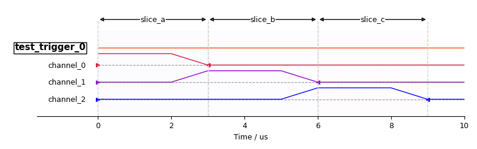
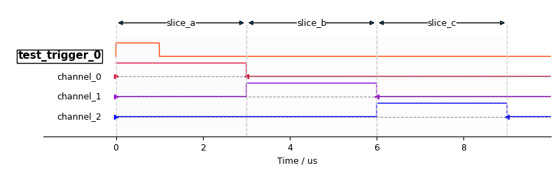

# ThunderQ

General time-sequential experiment framework.

## Features

- Designed for waveform, time sequence-based experiments.

- Breaks a time sequence into individual modules (i.e. procedures), allows
highly flexible module design, and automatically assembles modules together.

- Intuitive scan experiment("sweep") function, with realtime figure generation
and data file writer.

- Waveform description classes. Storing waveforms in abstract format, with
a set of methods to manipulate waveforms.

## Dependencies

- [device_repo](https://github.com/TerryGeng/device_repo), the device control
backend. 

- [ThunderBoard](https://github.com/TerryGeng/ThunderBoard), a real-time data
visualization platform.

## Concepts

- **Waveform-based experiment**: Waveform-based experiments usually utilize 
delay generators("trigger"), waveform generators, and signal generators to
operate a physical system in a short period of time. Rather than the PC command
each device step by step, waveform-based experiments require PC to "compile"
the waveforms and the time sequence first, then using "triggers" to run an
experiment.

- **Channel**: Usually, waveform-based experiments need to produce different
waveforms at different cables simultaneously. Each cable connects to different
port of the same waveform generator or different waveform generators. Each
port of the waveform generator is considered to be a _channel_ of it.

- **Sequence**: A _sequence_ is a timespan that a cycle of one 
experiments runs on, usually involves a bunch of channels triggered at different
time of the cycle.

- **Slice**: A sequence is composed by _slices_. A slice is a particular 
part of one sequence, marked by its start time and duration. In ThunderQ,
the `Sequence` class stores all slices and is in charge of composing the
waveforms among slices into the actually waveform performed by the waveform
generator.  A slice can be made up of a series of sub-slice.

- **Procedure**: A _procedure_ is a set of operations and waveforms to execute
within slices. In general cases, people pass slices into procedures as parameter
and let procedures write their own waveforms into slices. The benefit is: the
procedures don't need to worry about other waveforms in the sequence, and don't
have to care about align waveform across channels.

- **Cycle**: A cycle is a set of procedures performed after the triggered has been
triggered once. One experiment usually repeatedly performs a cycle many times,
with some parameters to be different each time ("scan" experiment or "sweep"
experiment).


## Installation

1. Install [device_repo](https://github.com/TerryGeng/device_repo) and 
[ThunderBoard](https://github.com/TerryGeng/ThunderBoard).

2. Install ThunderQ by executing
```bash
pip install --editable .
```
If you use virtual environment, you need to activate it first.

## Tutorial

We are going to start with a simple experiment that doesn't make much sense
physically: we would like to perform three square wave on three different waveform 
_channels_ consecutively.

The sequence of this simple experiment can be drawn as:
```
Channel 1 -------______________
Channel 2 _______-------_______
Channel 3 ______________-------
```

Let's divide this sequence into three slices as follows:
```
Channel 1 |-------|_______|_______|
Channel 2 |_______|-------|_______|
Channel 3 |_______|_______|-------|
           Slice A Slice B Slice C
```

As shown in this figure, in each slice, there's one channel that has been filled
with a square wave.

### Begin with procedure

To write this experiment down, the first thing we need is a _procedure_ to add
a square wave to a channel in one slice. Such procedure could be done by

```python
from thunderq.procedures.native import Procedure

class SquareWaveProcedure(Procedure):
    def __init__(self, name, channel, slice, amplitude, duration):
        # argument explained:
        # - name: the name of this procedure
        # - channel: the channel where this square wave should be performed
        # - slice: the slice where this square wave should be performed
        # - amplitude: the amplitude of this square wave
        # - duration: the duration of this square wave

        super().__init__(name)
        self.channel = channel
        self.slice = slice
        self.amplitude = amplitude
        self.duration = duration

    def pre_run(self):
        # this method needs to prepare all waveforms for this procedure,
        # and write them into slices. It will be called before waveforms are
        # written into each channels.

        # create a square wave
        from thunderq.waveforms.native.waveform import DC
        waveform = DC(self.duration, self.amplitude)
        
        # add this square wave to self.channel at self.slice
        self.slice.add_waveform(self.channel, waveform)

    def post_run(self):
        # this method will be called after one cycle has been done (all waveform
        # in all slices has been written into channels and been performed)

        # for SquareWaveProcedure, it doesn't need to do anything here.
        pass
```

### Put procedures into cycle

Now we have a procedure to write a square wave into a channel. Now we need to 
prepare a cycle to write three square waves into three channels. Let's call
such cycle to be `TripleSquareWaveCycle`.

```python
from thunderq.cycles.native import Cycle

class TripleSquareWaveCycle(Cycle):
    def __init__(self, square_wave_length, square_wave_amp,
                 channel1, channel2, channel3,
                 slice1, slice2, slice3, sequence):
        # sequence: the `sequence` object that holds all channels and slices
        super().__init__("Triple Square Wave Cycle", sequence)
        self.square_wave1 = SquareWaveProcedure("SquareWave1", 
                                                channel1,
                                                slice1,
                                                square_wave_amp, 
                                                square_wave_length)
        self.add_procedure(self.square_wave1)

        self.square_wave2 = SquareWaveProcedure("SquareWave2", 
                                                channel2,
                                                slice2,
                                                square_wave_amp, 
                                                square_wave_length)
        self.add_procedure(self.square_wave2)

        self.square_wave3 = SquareWaveProcedure("SquareWave3", 
                                                channel3,
                                                slice3,
                                                square_wave_amp, 
                                                square_wave_length)
        self.add_procedure(self.square_wave3)
```

### Describe experiment setup

After completing the cycle, we can start to run it. But before that, we need to
specify the experiment setup first.

For demonstration purpose, several _mock_ device has been prepared. You can use
them as if they are real devices connected to your PC. We just invoke them here.

```python
from thunderq.sequencer import AWGChannel, DGTrigger
from thunderq.helper.mock_devices import MockAWG, MockDG

# create three waveform channels with MockAWG
mock_awg0 = AWGChannel("mock_awg0", MockAWG("mock_awg0"))
mock_awg1 = AWGChannel("mock_awg1", MockAWG("mock_awg1"))
mock_awg2 = AWGChannel("mock_awg2", MockAWG("mock_awg2"))

# create trigger from mock delay generator
mock_dg = DGTrigger(MockDG())

from thunderq.runtime import Runtime

# runtime saves some common components used in an experiment like its sequence,
# the logger, and configurations, etc.
runtime = Runtime()

# set the frequency of this DG to be 100000 Hz (10um per cycle)
sequence = runtime.create_sequence(mock_dg, 100000)
# set the position of the edge of trigger line 0: to raise at 0 and drop after 1um
sequence.add_trigger("test_trigger_0", 0, 0, 1e-6) \
    .link_waveform_channel("channel_0", mock_awg0) \
    .link_waveform_channel("channel_1", mock_awg1) \
    .link_waveform_channel("channel_2", mock_awg2) # link channels that are triggered by this edge

# define three slices
from thunderq.sequencer import FlexSlice

# FlexSlice doesn't has a fixed start point and length
# it's start point is determined by slices before it, while its length depends
# on the waveform in it.
slice_a = FlexSlice("slice_a")
slice_b = FlexSlice("slice_b")
slice_c = FlexSlice("slice_c")

# add slices into sequence
sequence.add_slice(slice_a)
sequence.add_slice(slice_b)
sequence.add_slice(slice_c)
```

### Run cycle with experiment setup

Now we can run the cycle defined before with the setup above:
```python
cycle = TripleSquareWaveCycle(
            square_wave_length=3e-6, 
            square_wave_amp=1,
            channel1=mock_awg0, 
            channel2=mock_awg1, 
            channel3=mock_awg2, 
            slice1=slice_a,
            slice2=slice_b,
            slice3=slice_c,
            sequence=sequence)

# run the entire cycle
cycle.run()
```

You need to start the _ThunderBoard_ first (by running `thunderboard` in 
commandline and open http://127.0.0.1:2334/ in your broswer) first to receive 
the sequence graph.
After running all the code above, you will see the sequence plot posted to
the _ThunderBoard_.



The sequence plot may look a little bit distorted. That is due to the downsample
process used in sequence plot generating. To produce a precise sequence plot, 
you can specify the precision of the sequence plot by
```python
sequence.send_sequence_plot(plot_sample_rate=1e9)
```



